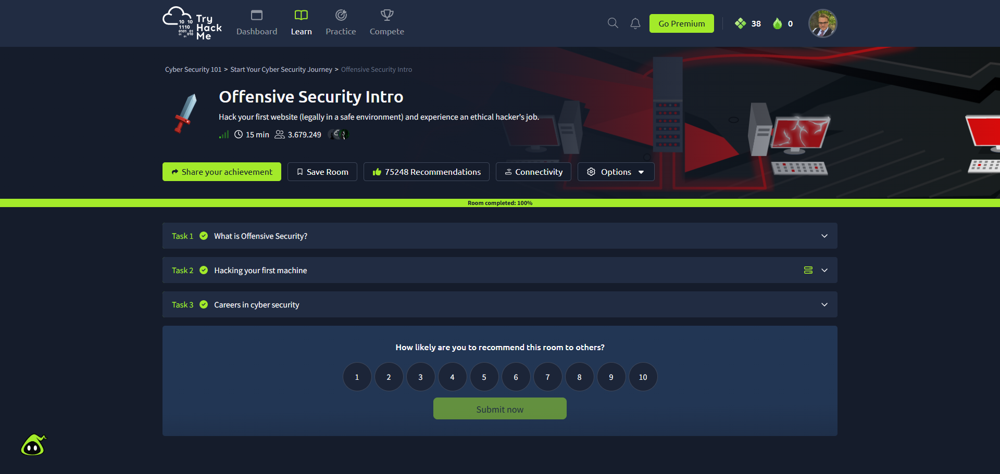

# TryStartMe

**Course:** Cyber Security Analyst - Introduction to Ethical Hacking  
**Room:** TryHackMe - Offensive Security Intro  
**Room URL:** https://tryhackme.com/room/offensivesecurityintro  
**Completion evidence:** https://tryhackme.com/room/offensivesecurityintro?utm_campaign=social_share&utm_medium=social&utm_content=share-completed-room&utm_source=copy&sharerId=68be8c5f0e07808854e63d28  
**Screenshot evidence:** embedded below and stored at Screenshots/1-TryStartMe-completion.png
**Completion date:** 2026-06-24  
**Sprint status:** Completed

---

## Objective

Complete the TryHackMe "Offensive Security Intro" room to become familiar with the platform workflow and the legal boundary of offensive security labs.

The important learning goal is not "hacking a random website"; it is understanding that offensive security work is only legitimate when the target, method, and scope are explicitly authorized.

---

## Work Log

| Step | Action | Result |
|---|---|---|
| 1 | Opened the official TryHackMe room page | Room identified as "Offensive Security Intro" |
| 2 | Confirmed the work is limited to the THM training environment | Scope is legal and intentionally isolated |
| 3 | Completed the guided room tasks in TryHackMe | Room completion shared via THM completion link |
| 4 | Recorded the completion evidence | Completion URL and screenshot path added to this solution |
| 5 | Summarized the learning outcome | Ethical hacking requires permission, scope, and controlled environments |

---

## Evidence

Completion evidence provided by TryHackMe share link:

https://tryhackme.com/room/offensivesecurityintro?utm_campaign=social_share&utm_medium=social&utm_content=share-completed-room&utm_source=copy&sharerId=68be8c5f0e07808854e63d28

Screenshot evidence:

The screenshot shows the TryHackMe room "Offensive Security Intro" completed at 100%.

The screenshot shows the TryHackMe room "Offensive Security Intro" with all three tasks completed and the room progress at 100%.

This link is kept as the external completion reference. No flags, credentials, tokens, or private lab output are included in this public write-up.

---

## Reviewer-Readable Result

| Field | Entry |
|---|---|
| Lab scope | TryHackMe "Offensive Security Intro" room only |
| Tool or method | TryHackMe browser-based guided lab |
| Key observation | Offensive security practice requires explicit permission and a defined target scope |
| Final evidence | TryHackMe completion share link and screenshot recorded on 2026-06-24 |
| Security lesson | Authorized labs are the correct place to practice offensive techniques safely |
| Redactions | No secrets, credentials, tokens, flags, or private data included |

---

## Validation Checklist

- [x] THM room completed.
- [x] Completion evidence link recorded.
- [x] Completion screenshot recorded.
- [x] Completion date added.
- [x] No unauthorized target was tested.
- [x] No fake flag, screenshot, or private artifact was added.

