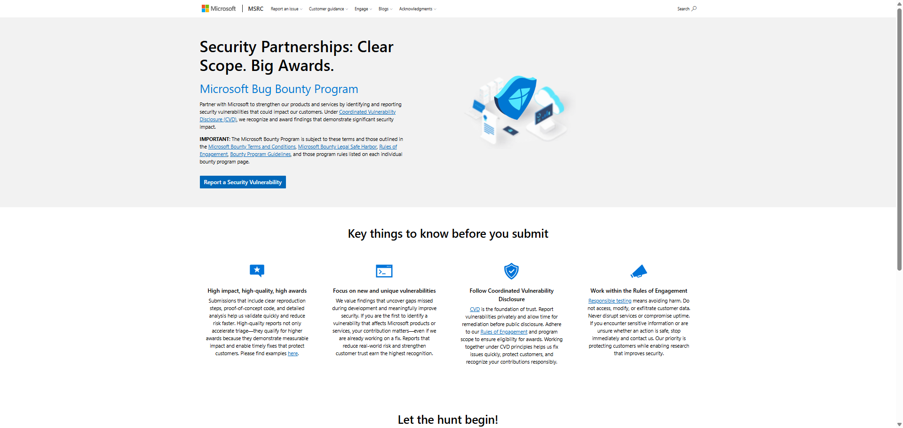

# Bounty Hunter

**Course:** Cyber Security Analyst - Ethical Hacking  
**Topic:** Responsible disclosure and bug bounty scope  
**Selected program:** Microsoft Bug Bounty Program  
**Official source:** https://www.microsoft.com/en-us/msrc/bounty  
**Screenshot evidence:** embedded below and stored at Screenshots/2-Bounty-Hunter-Microsoft-Bug-Bounty.png
**Source checked:** 2026-06-24  
**Sprint status:** Completed

---

## Objective

Understand why bug bounty work depends on written authorization, clearly defined scope, and responsible disclosure rules before any testing starts.

I selected Microsoft because its public MSRC bounty page clearly explains the relationship between bounty eligibility, Coordinated Vulnerability Disclosure, safe testing, and researcher responsibility.

---

## Source Review

Official source reviewed:

- Microsoft Bug Bounty Program: https://www.microsoft.com/en-us/msrc/bounty

Screenshot evidence:

The screenshot shows the Microsoft Bug Bounty Program page, including Coordinated Vulnerability Disclosure and Rules of Engagement guidance.

Key points from the Microsoft program page:

- Researchers are invited to report vulnerabilities that could impact Microsoft customers.
- Bounty eligibility depends on the program terms, legal safe harbor, rules of engagement, program guidelines, and the individual bounty program page.
- High-quality submissions should include clear reproduction steps, proof-of-concept material, and detailed analysis.
- Reports should follow Coordinated Vulnerability Disclosure.
- Testing must remain inside the published program scope.
- Researchers must avoid harm, including customer data access, data modification, data exfiltration, service disruption, or uptime compromise.

---

## Analysis

A bug bounty program is not a general permission slip. It is conditional authorization.

Before testing a real target, I would need to verify:

| Question | Why it matters |
|---|---|
| Is the target in scope? | Out-of-scope systems may be illegal or ineligible |
| Is the testing method allowed? | Some actions can cause service disruption or privacy harm |
| What data may be accessed? | Customer data must not be viewed, copied, modified, or exfiltrated |
| How should the report be submitted? | Responsible disclosure requires private reporting first |
| What evidence is enough? | A report needs proof, but only the minimum evidence required |

---

## Reviewer-Readable Result

| Field | Entry |
|---|---|
| Lab scope | Public review of Microsoft Bug Bounty Program rules |
| Tool or method | Official MSRC policy review |
| Key observation | Bug bounty testing is only authorized inside the written program scope and rules of engagement |
| Final evidence | Microsoft MSRC bounty page and screenshot reviewed on 2026-06-24 |
| Security lesson | Responsible security research requires scope validation, minimal proof, private reporting, and no harm to users or services |
| Redactions | No live target testing performed; no private data collected |

---

## Final Answer

Microsoft's bug bounty program shows that responsible security research is based on written scope, clear reporting, and harm avoidance. A valid researcher does not test random Microsoft assets just because a bounty program exists. The researcher first checks the specific program scope, follows the rules of engagement, collects only the minimum proof needed, reports privately through the correct MSRC channel, and avoids customer data access or service disruption.

The most important lesson is that ethical hacking is not defined by the tool being used. It is defined by permission, scope, restraint, and responsible disclosure.

