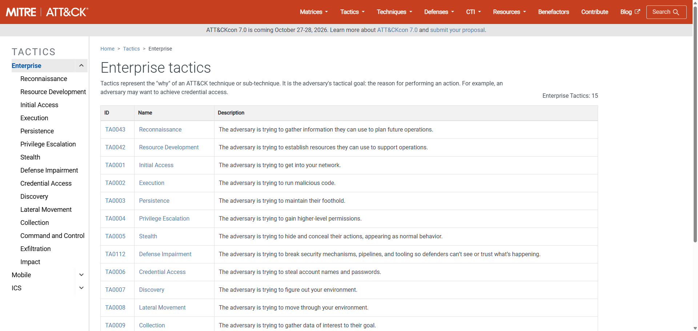

# Master Tactician

**Course:** Cyber Security Analyst - Ethical Hacking  
**Topic:** MITRE ATT&CK Enterprise Tactics  
**Official source:** https://attack.mitre.org/tactics/enterprise/  
**Screenshot evidence:** embedded below and stored at Screenshots/3-Master-Tactician-MITRE-Enterprise-Tactics.png
**Source checked:** 2026-06-24  
**Sprint status:** Completed

---

## Objective

Review the official MITRE ATT&CK Enterprise tactics page, identify tactics I already understand, and research one tactic that was less familiar.

---

## Evidence

Official source reviewed:

- MITRE ATT&CK Enterprise Tactics: https://attack.mitre.org/tactics/enterprise/

Screenshot evidence:

The screenshot shows the official MITRE ATT&CK Enterprise tactics page with the tactics list visible.

The screenshot shows the official MITRE ATT&CK Enterprise tactics page, including the page title, the tactics list, and the visible total of 15 Enterprise tactics.

---

## Source Review

MITRE describes tactics as the "why" behind a technique or sub-technique. In other words, a tactic is the adversary's tactical objective: the reason an adversary performs an action.

On 2026-06-24, the Enterprise tactics page listed 15 tactics:

| ID | Tactic | Short meaning |
|---|---|---|
| TA0043 | Reconnaissance | Gather information for future operations |
| TA0042 | Resource Development | Establish resources to support operations |
| TA0001 | Initial Access | Get into the target environment |
| TA0002 | Execution | Run malicious code |
| TA0003 | Persistence | Maintain a foothold |
| TA0004 | Privilege Escalation | Gain higher-level permissions |
| TA0005 | Stealth | Hide actions and appear normal |
| TA0112 | Defense Impairment | Break or weaken defensive mechanisms, pipelines, and tooling |
| TA0006 | Credential Access | Steal account names and passwords |
| TA0007 | Discovery | Learn about the environment |
| TA0008 | Lateral Movement | Move through the environment |
| TA0009 | Collection | Gather data of interest |
| TA0011 | Command and Control | Communicate with compromised systems |
| TA0010 | Exfiltration | Steal data |
| TA0040 | Impact | Manipulate, interrupt, or destroy systems and data |

---

## List A - Tactics I Already Understand

| Tactic | My understanding |
|---|---|
| Reconnaissance | The attacker gathers information before acting, for example public domains, employees, technologies, or exposed services. |
| Initial Access | The attacker finds a first way into the target, such as phishing, exploiting a public application, or using valid credentials. |
| Credential Access | The attacker tries to obtain usernames, passwords, hashes, tokens, or other authentication material. |

---

## List B - Tactic I Researched

| Tactic | Why I selected it |
|---|---|
| Defense Impairment | I was less familiar with this as a separate Enterprise tactic compared with the broader older idea of defense evasion. |

### Research Notes

Defense Impairment focuses on weakening the defender's ability to observe, trust, or respond. This can include breaking security mechanisms, disrupting telemetry, damaging pipelines, or making defensive tools unreliable.

The distinction matters because hiding from a tool and actively impairing the defensive system are not the same operational goal. For example, an attacker who disables logging, tampers with monitoring, or breaks alert delivery is not only trying to stay hidden; they are reducing the defender's ability to understand what is happening.

---

## Reviewer-Readable Result

| Field | Entry |
|---|---|
| Lab scope | Official MITRE ATT&CK Enterprise tactics page |
| Tool or method | Framework review and short tactic research |
| Key observation | Tactics describe adversary objectives, while techniques describe how those objectives are pursued |
| Final evidence | MITRE Enterprise tactics page and screenshot reviewed on 2026-06-24 |
| Security lesson | Mapping behavior to tactics helps defenders reason about attacker intent instead of only isolated indicators |
| Redactions | No sensitive data involved |

---

## Final Answer

Three tactics I understand reasonably well are Reconnaissance, Initial Access, and Credential Access. One tactic I researched further was Defense Impairment. I learned that this tactic is about breaking or weakening defensive mechanisms so defenders cannot reliably see, trust, or respond to attacker activity.

