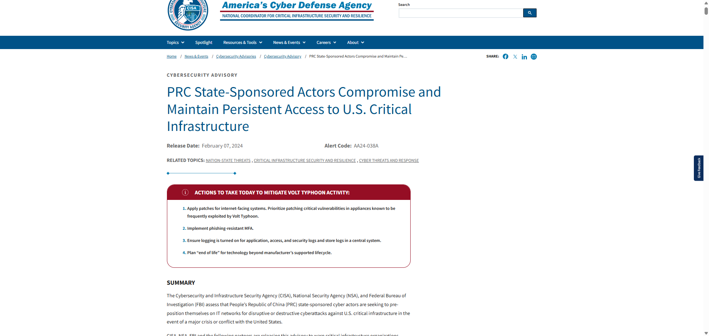
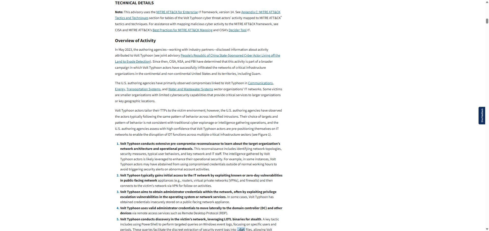
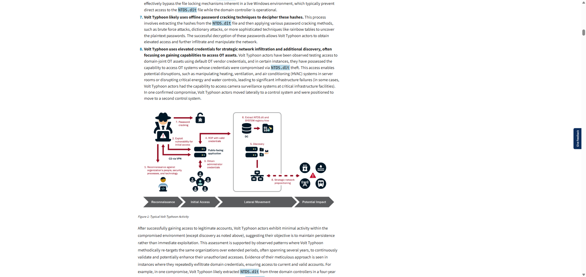

# The Attack

**Course:** Cyber Security Analyst - Ethical Hacking  
**Topic:** Threat actor analysis, CIA triad, and MITRE ATT&CK  
**Official source:** https://www.cisa.gov/news-events/cybersecurity-advisories/aa24-038a  
**Advisory:** CISA AA24-038A  
**Source checked:** 2026-06-24  
**Sprint status:** Completed

---

## Objective

Analyze a real-world cybersecurity advisory about PRC state-sponsored activity against U.S. critical infrastructure and explain the likely strategic motivation and possible CIA triad impact.

---

## Evidence

Official source reviewed:

- CISA Cybersecurity Advisory AA24-038A: https://www.cisa.gov/news-events/cybersecurity-advisories/aa24-038a

Screenshot evidence:

The first screenshot shows the CISA advisory title, release date, and summary context for PRC state-sponsored actors maintaining persistent access to U.S. critical infrastructure.

The second screenshot shows the technical overview, including references to Volt Typhoon activity, affected critical infrastructure sectors, and the assessment that the activity supports pre-positioning.

The third screenshot shows the typical activity flow and text describing credential theft, lateral movement, strategic positioning, and potential disruption of operational technology systems.

---

## Threat Actor Profile

The advisory attributes the activity to PRC state-sponsored cyber actors associated with Volt Typhoon.

The primary motivation appears to be strategic pre-positioning inside U.S. critical infrastructure networks. The goal is not simple website defacement or short-term criminal profit. The advisory describes behavior consistent with long-term access, stealth, credential use, lateral movement, and preparation for possible disruptive or destructive operations during a future crisis or conflict.

In practical terms, the actor wants access that can be used later. Critical infrastructure sectors are valuable because disruption could create pressure, delay response, or affect public services.

---

## CIA Triad Impact

If the actor successfully compromised and maintained persistence in a communications, transportation, energy, or water-sector environment, all three CIA triad principles could be affected.

| CIA principle | Potential impact | Example in this scenario |
|---|---|---|
| Confidentiality | Sensitive operational, network, credential, and architecture information could be exposed. | The actor could collect account data, domain information, remote access details, or documentation about critical systems. |
| Integrity | Systems, configurations, logs, or operational data could be altered or made untrustworthy. | Compromised administrator credentials could allow changes to routing, authentication, monitoring, or operational settings. |
| Availability | Critical services could be interrupted or degraded. | Access to operational technology or support systems could enable disruption of communications, transport coordination, energy delivery, water operations, or HVAC systems. |

---

## MITRE ATT&CK Mapping

The screenshots and advisory behavior align with several ATT&CK tactics:

| Tactic | Why it fits |
|---|---|
| Reconnaissance | The actor studies target architecture, security processes, operational protocols, and staff behavior. |
| Initial Access | The advisory describes access through public-facing appliances such as routers, VPNs, and firewalls. |
| Credential Access | The actor attempts to obtain administrator credentials and extract credential material such as domain hashes. |
| Lateral Movement | Valid credentials and remote access services are used to move through the network. |
| Discovery | The actor performs internal discovery to understand systems, accounts, and network relationships. |
| Persistence | The activity emphasizes maintaining long-term access rather than immediate exploitation. |
| Impact | The strategic concern is future disruption of critical services. |

---

## Reviewer-Readable Result

| Field | Entry |
|---|---|
| Lab scope | Public CISA advisory review only |
| Tool or method | Threat intelligence reading, CIA triad analysis, MITRE ATT&CK mapping |
| Key observation | The activity is best understood as long-term strategic pre-positioning against critical infrastructure |
| Final evidence | CISA AA24-038A reviewed with three embedded screenshots |
| Security lesson | Persistent access in critical infrastructure is dangerous because it can affect confidentiality, integrity, and availability before any visible disruption occurs |
| Redactions | No private data, credentials, flags, or live target information included |

---

## Final Answer

The advisory suggests that the PRC state-sponsored actor's primary strategic goal is to pre-position inside U.S. critical infrastructure networks for potential future disruption or destructive activity. This is more serious than ordinary espionage because the access could be used during a crisis to interfere with essential services.

All three CIA triad principles could be compromised. Confidentiality could be affected through exposure of credentials, network architecture, operational data, and internal documentation. Integrity could be affected if the actor modifies configurations, authentication settings, logs, or operational controls. Availability could be affected if the actor uses its access to disrupt communications, transportation, energy, water, or other critical infrastructure functions.
