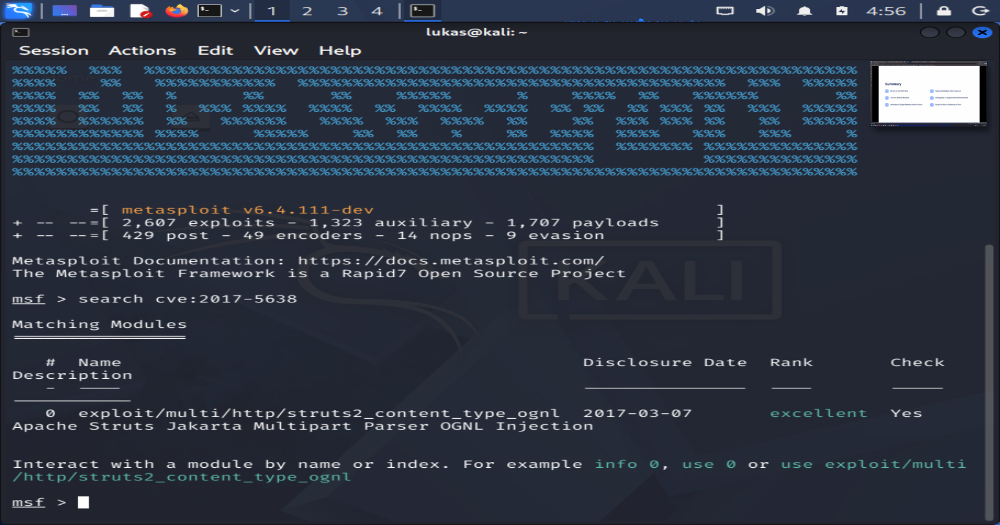

# Module Pokedex

**Course:** Cyber Security Analyst - Ethical Hacking  
**Topic:** Metasploit module discovery  
**Tool:** Metasploit Framework / msfconsole  
**Target CVE:** CVE-2017-5638  
**Source checked:** 2026-06-24  
**Sprint status:** Completed

---

## Objective

Use `msfconsole` to search for a Metasploit module related to Apache Struts CVE-2017-5638 and record the relevant exploit module path.

---

## Evidence

Screenshot evidence:



The screenshot shows `msfconsole` running on the Kali VM and the command:

```text
search cve:2017-5638
```

The result lists one matching module:

```text
exploit/multi/http/struts2_content_type_ognl
```

---

## Work Log

| Step | Action | Result |
|---|---|---|
| 1 | Started Kali VM and opened a terminal | Kali shell available as user `lukas` |
| 2 | Started Metasploit with `msfconsole` | Metasploit Framework loaded successfully |
| 3 | Searched for `cve:2017-5638` | One relevant Apache Struts module found |
| 4 | Recorded the full module path | `exploit/multi/http/struts2_content_type_ognl` |

---

## Finding

| Field | Result |
|---|---|
| CVE searched | CVE-2017-5638 |
| Vulnerability family | Apache Struts Jakarta Multipart Parser OGNL injection |
| Relevant Metasploit module | `exploit/multi/http/struts2_content_type_ognl` |
| Disclosure date shown | 2017-03-07 |
| Rank shown | excellent |
| Check support shown | Yes |

---

## Security Relevance

CVE-2017-5638 is a critical Apache Struts vulnerability associated with OGNL injection through multipart request handling. The exercise shows how Metasploit can be used as a module index: before running anything, an analyst can search by CVE, inspect the module name, check ranking, and understand whether a module has a check function.

This task was limited to module discovery. No exploit was executed and no live target was attacked.

---

## Reviewer-Readable Result

| Field | Entry |
|---|---|
| Lab scope | Local Kali VM and Metasploit module search only |
| Tool or method | `msfconsole` search command |
| Key observation | Metasploit contains a module for Apache Struts CVE-2017-5638 |
| Final evidence | Embedded screenshot of the `search cve:2017-5638` result |
| Security lesson | Searching by CVE helps identify relevant modules before any active testing is attempted |
| Redactions | No credentials, target IPs, payloads, or private data included |

---

## Final Answer

The relevant Metasploit module for CVE-2017-5638 is:

```text
exploit/multi/http/struts2_content_type_ognl
```

The module description shown by Metasploit is `Apache Struts Jakarta Multipart Parser OGNL Injection`, with disclosure date `2017-03-07`, rank `excellent`, and check support listed as `Yes`.
