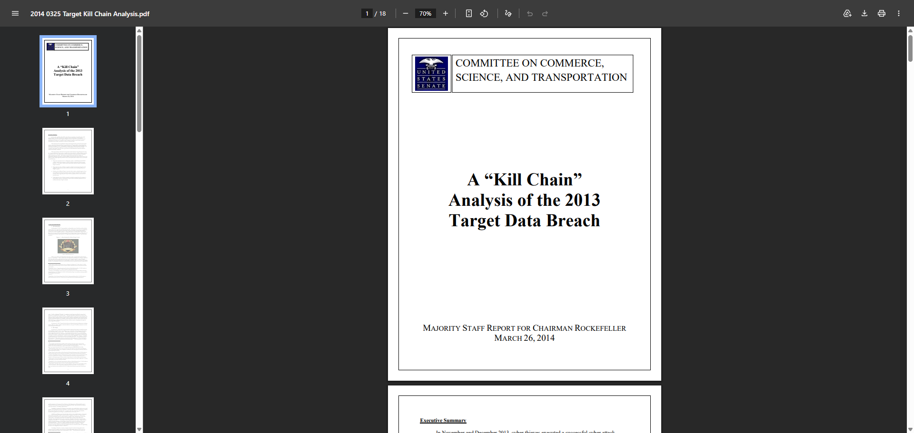
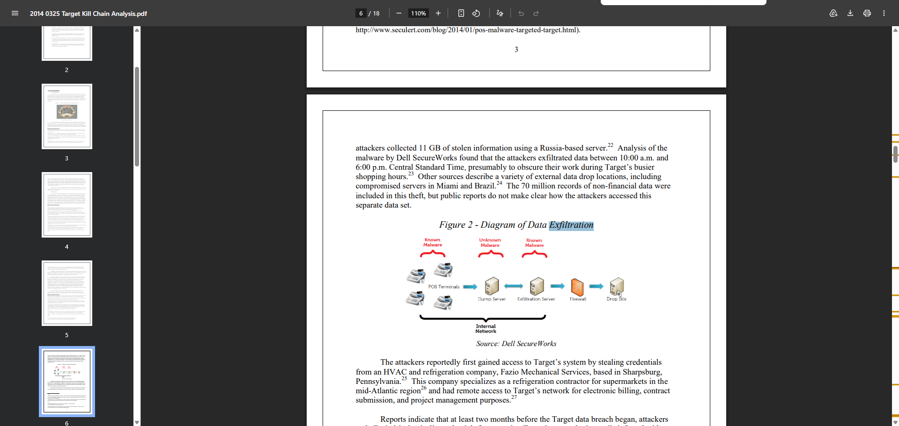
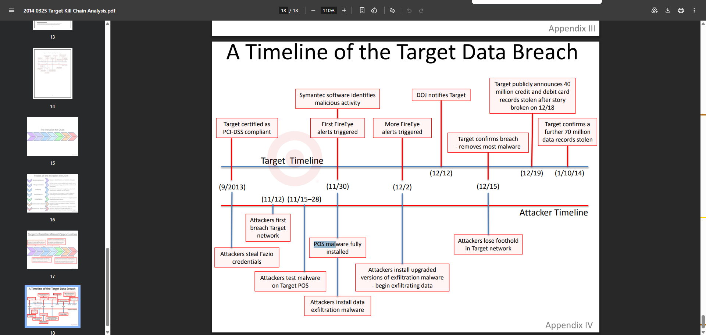

# From Theory to Practice

**Course:** Cyber Security Analyst - Ethical Hacking  
**Topic:** Target 2013 data breach, kill chain analysis, and tool mapping  
**Official source:** https://www.commerce.senate.gov/services/files/24d3c229-4f2f-405d-b8db-a3a67f183883  
**Report:** A "Kill Chain" Analysis of the 2013 Target Data Breach  
**Source checked:** 2026-06-24  
**Sprint status:** Completed

---

## Objective

Analyze an official report about the 2013 Target data breach, identify the main attack stages, and relate the observed techniques to security testing concepts and possible Metasploit-style module discovery.

---

## What I Did

This was not an exploitation task. I reviewed a public incident report and translated the incident into security-analysis language:

1. How did the attackers get initial access?
2. How did they move toward sensitive systems?
3. What malware or techniques were used?
4. How was data exfiltrated?
5. Where did Target miss chances to stop the attack?

---

## Evidence

Official report reviewed:

- U.S. Senate Committee staff report: https://www.commerce.senate.gov/services/files/24d3c229-4f2f-405d-b8db-a3a67f183883

Screenshot evidence:

The first screenshot shows the official report title: `A "Kill Chain" Analysis of the 2013 Target Data Breach`.

The second screenshot shows the executive summary, including the high-level findings about third-party vendor access, missed warnings, lateral movement, and exfiltration routes.

The third screenshot shows data exfiltration details and the section describing initial access through stolen credentials from Fazio Mechanical Services.

The fourth screenshot shows the incident timeline, including stolen Fazio credentials, POS malware installation, FireEye alerts, exfiltration malware, and public breach disclosure.

---

## Attack Chain Summary

| Stage | What happened | Security meaning |
|---|---|---|
| Reconnaissance | Attackers likely learned about Target's vendors and external access paths. | Third-party relationships can reveal entry points. |
| Initial Access | Attackers stole credentials from Fazio Mechanical Services, an HVAC vendor with access to Target systems. | Vendor credentials became the initial foothold. |
| Lateral Movement | Attackers moved from less sensitive network areas toward POS and data-handling systems. | Network segmentation appears to have been insufficient. |
| Malware Installation | POS malware and exfiltration malware were installed. | The attack moved from access to data capture and staging. |
| Detection Failure | Security tools generated warnings, but the organization did not stop the activity in time. | Alerts only help if response processes work. |
| Exfiltration | Stolen data was moved through internal systems and then out to external infrastructure. | Data loss prevention and egress monitoring failed to stop the theft. |

---

## Potential Metasploit / Testing Connections

This report does not point to a single CVE like the previous Metasploit exercise. Instead, it maps to categories of testing an analyst might perform in a lab:

| Incident technique | Lab/testing concept | Example tool area |
|---|---|---|
| Stolen vendor credentials | Credential validation and access review | Metasploit auxiliary modules, login scanners, or manual access checks in authorized labs |
| Weak segmentation | Internal network path testing | Network scanning, route discovery, firewall validation |
| POS malware behavior | Malware analysis and endpoint detection | Static/dynamic analysis tools, SIEM alerts |
| Data staging and exfiltration | Egress monitoring and DLP testing | Log review, firewall logs, proxy logs, SIEM correlation |
| Missed alerts | Detection engineering | Alert triage, incident response playbooks |

Important: the correct lesson is not to run exploits against Target. The useful exercise is to understand how a real intrusion progressed and how controls could have interrupted it.

---

## Main Findings

The Target breach shows that a major incident can begin with a non-obvious entry point. The attackers did not need to start by directly attacking the most sensitive payment systems. They first used a third-party vendor relationship, then moved deeper into the environment.

The report also shows that technical tools alone are not enough. Target had security products that generated warnings, but the response did not stop the attack. This makes the breach a strong example of why detection, escalation, segmentation, and response procedures matter as much as tools.

---

## Reviewer-Readable Result

| Field | Entry |
|---|---|
| Lab scope | Public review of official Target breach report |
| Tool or method | Incident report analysis, kill chain mapping, testing concept mapping |
| Key observation | The breach combined third-party credential compromise, lateral movement, POS malware, missed alerts, and exfiltration |
| Final evidence | Four embedded screenshots from the official report |
| Security lesson | Real attacks often succeed through weak process, weak segmentation, and missed response opportunities, not only through one technical exploit |
| Redactions | No private credentials, live targets, or customer data included |

---

## Final Answer

The Target breach began with stolen third-party vendor credentials, reportedly from Fazio Mechanical Services. After gaining that foothold, the attackers moved inside Target's environment, reached payment-related systems, installed POS malware, staged stolen data internally, and then exfiltrated it to external infrastructure.

The key security lesson is that the attack chain had multiple possible interruption points: vendor access control, network segmentation, malware alert response, and outbound data monitoring. In a lab context, this maps less to one specific exploit module and more to a set of testing activities: credential exposure review, segmentation validation, malware detection, alert handling, and exfiltration monitoring.
